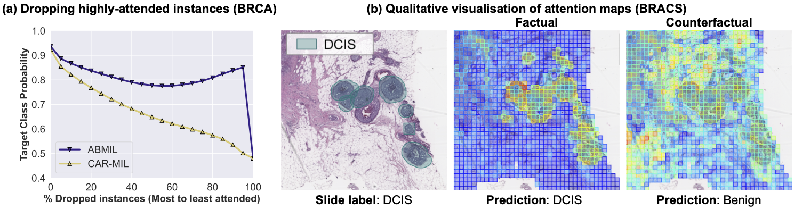

# CAR-MIL

Code for two related papers on **counterfactual reasoning for attention in Multiple Instance
Learning (MIL)** in computational pathology:

- **CAR-MIL: Counterfactual Attention Regularization for Multiple Instance Learning** 
  I. Chraki, P. Marza, S. Christodoulidis, M. Vakalopoulou (ECCV 2026).
- **Counterfactual Intervention in Attention Multiple Instance Learning for Digital Pathology
  (CIA-MIL)**  I. Chraki, P. Marza, S. Christodoulidis, M. Vakalopoulou (MIDL 2026).

CAR-MIL is an extension of CIA-MIL. This repository is the reference implementation for
CAR-MIL and also contains the CIA-MIL training code.

<p align="center">
  
</p>

<p align="center"><em>
(a) Dropping the most highly-attended instances degrades CAR-MIL's confidence faster than
ABMIL on TCGA-BRCA. (b) On a BRACS DCIS slide, the factual branch attends to the carcinoma and
predicts DCIS, while the counterfactual branch reallocates evidence and flips the prediction to
Benign.
</em></p>

## Overview

Attention-based MIL aggregates patch (instance) features into a slide (bag) representation
through learned attention weights. Those weights are the usual proxy for interpretability, but
they do not always reflect true instance importance and can latch onto spuriously correlated
regions. Both methods here add a **counterfactual attention branch** and a training signal that
forces the model's decision to depend on the causal effect of the attended evidence.

| | CIA-MIL (MIDL 2026) | CAR-MIL (ECCV 2026) |
|---|---|---|
| Counterfactual attention | **fixed** random / uniform attention `Ā` | **learned** counterfactual attention |
| Training signal | effect term `L_CE(Y(A,X) − Y(do(A=Ā),X), y)` | effect term + attention-proximity term |
| Objective | `L = L_cls + λ·L_effect` | `L = L_cls + α·L_diff + λ·L_div` |
| Goal | causally align attention, keep performance | complementary factual/counterfactual maps, keep or improve performance |
| Script | [`src/main_cia.py`](src/main_cia.py) | [`src/main_car.py`](src/main_car.py) |

---

## Code base

The training pipeline (dataloaders, CV splitting, metrics, backbone implementations) is adapted
from [RRT-MIL](https://github.com/DearCaat/RRT-MIL) / [MHIM-MIL](https://github.com/DearCaat/MHIM-MIL).
The perturbation ("patch dropping") faithfulness evaluation in [`src/eval.py`](src/eval.py)
follows [xMIL (Hense et al., NeurIPS 2024)](https://arxiv.org/abs/2406.04280).


## Installation

```bash
conda create -n carmil python=3.9 -y
conda activate carmil

# PyTorch -> match your CUDA version
pip install torch torchvision

pip install timm h5py pandas numpy scikit-learn tqdm nystrom-attention wandb
```

---

## Data preparation

The models consume **pre-extracted patch features**, not raw WSIs. In the papers, slides are
tiled into 256×256 patches at 20× and encoded with [UNI-v1](https://huggingface.co/MahmoodLab/UNI)
(main results) or ImageNet ResNet-50 (ablation); any encoder works. Set `--input_dim` to the
feature dimension (1024 for UNI and ResNet-50; 512 for PLIP).

Expected `--dataset_root` layout:

| `--datasets` | Label file | Feature files | Notes |
|--------------|-----------|---------------|-------|
| `camelyon16` | `metadata.csv` with `slide_id,label` | `h5_files/<slide_id>.h5` (`features` dataset) | `normal` → 0, else → 1 |
| `tcga` | `label.csv` with `patient_id,label` | `pt_files/<slide_id>.pt` | `--tcga_sub {brca,nsclc}`; IDC / LUAD → 0 |
| `luad_tp53` | `metadata.csv` with `slide_id,TP53` | `pt_files/<slide_id>.pt` | `TP53` → 1, else → 0 |

Example label CSVs for TCGA-BRCA and TCGA-NSCLC are in [`src/data_label/`](src/data_label/).

---

## Usage

Run from `src/`. Checkpoints and per-fold metric CSVs are written to
`$MODEL_PATH/$PROJECT/$TITLE/`. `--task_id k` selects a single CV fold (built for job arrays);
pass it even for single-GPU runs.

### 1. Baseline

```bash
python main.py \
  --datasets tcga --tcga_sub brca --dataset_root $DATA --input_dim 1024 \
  --model gattmil --cv_fold 5 --task_id 0 \
  --num_epoch 100 --lr 2e-4  \
  --model_path $OUT --project brca_baseline --title gattmil
```

### 2. CAR-MIL

```bash
python main_car.py \
  --datasets tcga --tcga_sub brca --dataset_root $DATA --input_dim 1024 \
  --model gattmil --cv_fold 5 --task_id 0 --num_epoch 100 \
  --alpha_effect 0.2 --alpha_att 0.2 --reg_dist COS \
  --init_ckpt $OUT/brca_baseline/gattmil \
  --model_path $OUT --project brca_car --title gattmil_car
```

- `--model` ∈ `{attmil, gattmil, transmil, dsmil}` → the corresponding `_CF` variant.
- `--reg_dist` ∈ `{L1, COS}`. The paper finds cosine helps most on the harder LUAD / BRACS
  tasks, L1 is competitive on BRCA / NSCLC subtyping.
- `--init_ckpt` optionally warm-starts from a baseline: pass a directory (loads
  `fold_<k>_model_best_auc.pt`) or a `.pt` file; `none` trains from scratch.
- Hyperparameter sweep in the paper: `α, λ ∈ {0.2, 0.8, 1.0}`.

### 3. CIA-MIL

```bash
python main_cia.py \
  --datasets tcga --tcga_sub brca --dataset_root $DATA --input_dim 1024 \
  --model cia_gattmil --cv_fold 5 --task_id 0 --num_epoch 100 \
  --alpha_effect 0.2 \
  --model_path $OUT --project brca_cia --title gattmil_cia
```

`--model` ∈ `{cia_gattmil, cia_clam_sb, cia_dsmil}` (also accepts `clam_sb` / `dsmil`).

### 4. Faithfulness evaluation

[`src/eval.py`](src/eval.py) loads `fold_<k>_model_best_auc.pt`, recomputes classification
metrics, and runs a MoRF (Most-Relevant-First) perturbation test in the style of
[xMIL (Hense et al., NeurIPS 2024)](https://arxiv.org/abs/2406.04280): patches are dropped (or
added) in attention order and the target-class probability plus attention entropy / Gini are
tracked per slide — the perturbation curves behind the AUPC / AOPCR numbers in the papers.

```bash
python eval.py \
  --datasets tcga --tcga_sub brca --dataset_root $DATA --input_dim 1024 \
  --model gattmil --cv_fold 5 --task_id 0 \
  --approach drop --strategy 1%-of-all --order morf \
  --attribution_strategy original \
  --model_path $OUT --project brca_car --title gattmil_car
```

| Flag | Choices | Meaning |
|------|---------|---------|
| `--approach` | `drop`, `add` | remove most-relevant patches, or start empty and add them |
| `--strategy` | `1%-of-all`, `one-by-one` | perturbation step size |
| `--order` | `morf`, `morl` | most- vs least-relevant first |
| `--attribution_strategy` | `original`, `random`, `absolute` | which patch scores to rank by |

Outputs go to `$MODEL_PATH/.../Eval_Flapping/*.csv`.

---

## Citation

```bibtex
@inproceedings{chraki2026carmil,
  title     = {{CAR-MIL}: Counterfactual Attention Regularization for Multiple Instance Learning},
  author    = {Chraki, Imane and Marza, Pierre and Christodoulidis, Stergios and Vakalopoulou, Maria},
  booktitle = {European Conference on Computer Vision (ECCV)},
  year      = {2026}
}

@inproceedings{chraki2026ciamil,
  title     = {Counterfactual Intervention in Attention Multiple Instance Learning for Digital Pathology},
  author    = {Chraki, Imane and Marza, Pierre and Christodoulidis, Stergios and Vakalopoulou, Maria},
  booktitle = {Medical Imaging with Deep Learning (MIDL)},
  year      = {2026}
}
```

---

## Acknowledgements

Built on [RRT-MIL](https://github.com/DearCaat/RRT-MIL) /
[MHIM-MIL](https://github.com/DearCaat/MHIM-MIL), with backbones from
[CLAM](https://github.com/mahmoodlab/CLAM), [DSMIL](https://github.com/binli123/dsmil-wsi),
[TransMIL](https://github.com/szc19990412/TransMIL), and
[IBMIL](https://github.com/HHHedo/IBMIL). The counterfactual-attention idea follows
[Rao et al., *Counterfactual Attention Learning*, ICCV 2021](https://arxiv.org/abs/2108.08728),
and the faithfulness evaluation follows
[Hense et al., *xMIL*, NeurIPS 2024](https://arxiv.org/abs/2406.04280).
Results are based in part upon data generated by the [TCGA Research Network](https://www.cancer.gov/tcga).
This work was supported by the Agence Nationale de la Recherche (ANR-21-RHUS-0003,
ANR-21-CE45-0007, ANR-23-CE45-0029, ANR-23-IAHU-0002, ANR-23-IACL-0003 – DATAIA CLUSTER), with
HPC resources from the Mésocentre of CentraleSupélec / ENS Paris-Saclay and GENCI–IDRIS.
